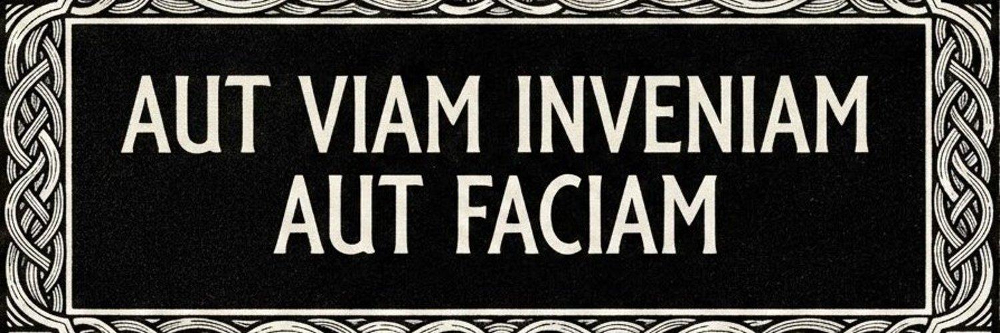

<!-- 📸 Sube tu imagen como header.png (o .gif) a la raíz del repo TU_USERNAME/TU_USERNAME -->

  

[English Version below](#-hello)

---

## 👋 Hola

De mí solo vas a saber lo que yo quiera que sepas. No cometas el error de perfilarme por lo que leas aquí.

Soy analista de Ciberinteligencia en un MSSP. Mi trabajo consiste en darle sentido al ruido, recopilar, analizar y convertir datos en bruto en inteligencia accionable. Mi día a día vive en la intersección entre OSINT, contrainteligencia y seguridad ofensiva, con una obsesión creciente por construir herramientas con IA que realmente ayuden a los analistas a hacer su trabajo.

No me considero experto en absolutamente nada. Lo que sí soy al 100% es alguien que pregunta, que lo cuestiona todo y que aprende.

Creo que las mejores herramientas son las que te construyes tú. Todo lo que hay aquí es auto-alojable, nativo de terminal y diseñado para resolver problemas operativos reales. Si una herramienta que necesito no existe, eso no es una queja, es una especificación de proyecto.

## 📜 Manifiesto

### Poder

La misma pregunta mueve todo lo que hago, ya sea un informe STIX, la arquitectura de un honeypot o un libro en mi estantería: **¿quién tiene el poder y cómo lo ejerce?**

No creo que se pueda hacer trabajo de inteligencia serio sin una teoría del poder. No una ideología, una teoría. Una que explique cómo se fabrican las narrativas, cómo se normaliza la vigilancia, cómo las instituciones capturan la disidencia y la reempaquetan como conformidad. Mis lecturas se mueven en la intersección entre teoría crítica, filosofía política y seguridad ofensiva: Žižek, Fisher, Bauman, Land, Stoll, Mitnick. Leo a mis adversarios intelectuales, Hicks, Land, con la misma atención que a mis afinidades naturales, Žižek, Fisher. El objetivo es entender el mapa completo, incluidas las salidas de emergencia que algunos tomaron y adónde les llevaron.

Me interesa la superestructura, ideología, narrativa, mecanismos de control, más que la economía material pura. No porque la base no importe, sino porque la superestructura es donde hoy se libra la batalla real. El algoritmo es la nueva planta de producción. El feed es la nueva cadena de montaje.

### Política

Izquierda heterodoxa, anti-liberal, anti-identitaria. Más cerca de la crítica materialista que del progresismo institucional. No soy socialdemócrata, no soy libertario, y no me interesa la decadencia gestionada que pasa por centrismo, si quieres llamarme anarquista, adelante. Veo el sistema como un problema estructural, pero desconfío profundamente de las soluciones que ofrecen tanto la derecha como la izquierda mainstream, la primera porque sirve al capital abiertamente, la segunda porque lo sirve mientras finge no hacerlo.

Creo en la soberanía individual, epistémica, técnica y política. No como fantasía libertaria atomizada, sino como precondición de cualquier acción colectiva con sentido. No se puede construir solidaridad entre personas que no saben pensar por sí mismas. Rousseau es el único teórico político clásico en mi estantería, y no es casualidad: el contrato social como ficción necesaria, no como verdad revelada.

En lo temperamental, siempre tendré más paciencia con un adversario inteligente que con un aliado superficial.

### Tecnología

**Auto-alojable antes que SaaS.** 
Si tu herramienta llama a casa, no es tu herramienta, es el sensor de otro apuntándote. Cada dependencia cloud es una decisión de confianza, y hay muy pocas entidades en las que confíe mis datos, mis flujos de trabajo o la inteligencia de mis clientes.

**Terminal antes que GUI.** 
El ratón es una concesión, no un punto de partida. Las interfaces gráficas optimizan para la accesibilidad; los terminales optimizan para el poder. Sé cuál de los dos necesito a las 3 de la mañana durante una respuesta a incidentes.

**IA local antes que dependencia cloud.** 
Los LLMs son transformadores, pero enrutar tu inteligencia de amenazas por la API de otro es una decisión de OPSEC que la mayoría no se da cuenta de que está tomando. Construyo pipelines local-first, RTX 4090, modelos cuantizados, inferencia a coste cero, y trato la nube como fallback, nunca como opción por defecto.

**Open source antes que propietario.** 
No solo por ideología, sino porque la auditabilidad es una propiedad de seguridad. Código que no puedo leer es código en el que no puedo confiar. Esto aplica a mis herramientas, a mis modelos de IA y a los sistemas que ayudo a defender.

**Construir antes que comprar.** 
Los productos de estantería resuelven el caso de uso medio. El trabajo de inteligencia nunca es el caso de uso medio. Cada herramienta en mis repos existe porque la alternativa era confiar en las asunciones de otro sobre mi flujo de trabajo.

### Oficio

Creo en la muerte del amateur, no como gatekeeping, sino como diagnóstico. La accesibilidad de masas está matando el oficio en el software, en la arquitectura, en el diseño de videojuegos, en todo lo que toca. Cuando optimizas para el mínimo común denominador, obtienes productos que nadie odia y nadie ama. Prefiero construir algo que cinco personas encuentren indispensable a algo que cinco mil encuentren adecuado.

La industria del videojuego perdió el alma en el momento en que decidió que cada experiencia tenía que ser accesible para todos. La arquitectura perdió los nervios cuando dejó de construir para la permanencia. El software pierde filo cada vez que un framework prioriza la experiencia del desarrollador sobre el poder del usuario.

No construyo para el mercado. Construyo para la misión.

### Inteligencia

Inteligencia no es información. La información es ruido hasta que un analista aplica juicio, contexto y pensamiento adversarial para convertirla en algo accionable. Las herramientas que construyo existen para amplificar ese proceso, no para sustituirlo. La IA aumenta al analista, no lo reemplaza.

El mejor trabajo de inteligencia ocurre en la intersección entre capacidad técnica y pensamiento crítico. Necesitas entender cómo funciona la infraestructura del adversario *y* por qué eligió construirla así. Necesitas tradecraft OSINT *y* una teoría de la motivación. Necesitas leer tráfico de red *y* geopolítica.

Por eso mis repos contienen tanto sistemas de honeypots como referencias a Žižek. Es la misma disciplina, aplicada en capas distintas del stack.

## 🔧 Especialización

Mi trabajo principal gira en torno a la Ciberinteligencia de Amenazas, desde la recopilación OSINT y el mapeo de superficies de ataque hasta operaciones de contrainteligencia. Me especializo en diseñar sistemas multi-agente con IA que potencien los flujos de trabajo del analista, no que los sustituyan. Trabajo extensivamente con integraciones MCP, orquestación de LLMs y sistemas de gestión de conocimiento basados en Obsidian para construir pipelines de inteligencia que escalen.

En el lado ofensivo, me centro en metodologías de red team, automatización de reconocimiento y construcción de sistemas de engaño como honeypots procedurales que engañan tanto a humanos como a atacantes con IA. Abordo la seguridad desde la perspectiva del adversario para defender mejor contra amenazas reales.

## 🚧 Proyectos (Todos en Desarrollo)

**SYNAPSE**, Sistema de honeypots procedurales generados por IA con emulación multi-protocolo, salida CTI en STIX/TAXII y detección heurística de atacantes IA. Honeypots que no parecen honeypots.

**CORVUS**, Sistema multi-agente para gestión de bóvedas de inteligencia. Una jerarquía de 4 agentes (CORVUS-PRIME · CORVUS-TAG · CORVUS-ANL · PIKO-REV) orquestando flujos CTI dentro de Obsidian.

**SCIFORGE**, Motor de transformación bidireccional de documentos científicos. Corpus → paper IMRaD, paper → JSON estructurado y grafos de conocimiento. Capa LLM agnóstica de proveedor orientada a pipelines locales de coste cero.

**RALPH**, App de escritorio para anonimización de documentos construida con Rust/Tauri 2 y Svelte 5. Sistema jerárquico de tokens, flujos de vinculación de entidades, renderizado Markdown. Nació de ver a ejecutivos fracasar estrepitosamente en OPSEC.

**CORVOS Suite**, Arquitectura Docker Compose + Traefik que unifica herramientas OSINT bajo un único dashboard Svelte con volúmenes compartidos, acceso a terminal y enrutamiento automatizado de herramientas para flujos de trabajo diarios del analista.

**Network Diagnostic TUI**, Diagnóstico de red por terminal multiplataforma con análisis por capas OSI, módulos específicos por fabricante y análisis heurístico de causa raíz.

## 🧰 Tech Stack

## 🛡️ Frameworks y Estándares con los que Trabajo

Esto no es una wishlist, son los frameworks, estándares y técnicas analíticas que uso en producción.

### Estándares Analíticos (IC)

Rigor, distinción entre hechos y análisis, disciplina de sourcing. La línea base de cualquier producto de inteligencia que merezca llamarse tal.

### Técnicas Analíticas Estructuradas (SATs)

Matrices evidencia vs. hipótesis con scoring de diagnosticidad, validación sistemática de supuestos, desarrollo de indicadores observables, modelado de futuros alternativos y perspectivas adversariales integradas. No son ejercicios académicos, son la estructura de cada evaluación que produzco.

### Frameworks de Correlación Táctica

MITRE ATT&CK para mapear indicadores a TTPs concretas. Diamond Model (adversario-capacidad-infraestructura-víctima) para correlación granular más allá de la integración multi-fuente básica. La fase TTI de TIBER-EU para producir escenarios de ataque accionables basados en el perfil específico del target, no amenazas genéricas. STIX/TAXII para output estructurado que alimente sistemas automatizados, especialmente relevante con SYNAPSE en desarrollo. MSIF para integración multi-fuente con evaluación de independencia y detección de cámaras de eco.

### Capa de Contexto Regulatorio

No son frameworks analíticos, son el contexto regulatorio que condiciona qué nivel de confianza requiere qué tipo de acción. Los criterios de categorización de incidentes ICT de DORA (impacto transfronterizo, clientes afectados, duración) alimentan directamente el sistema de clasificación para que el output venga pre-etiquetado con relevancia regulatoria. Crítico en un MSSP donde cada cliente tiene un perfil regulatorio diferente.

### Calidad y Confianza

Calibración de confianza ajustada por fiabilidad de fuentes. Verificación de consistencia y atribución de fuentes en outputs de LLMs. Detección sistemática de confirmation bias, cherry-picking y overconfidence. Mapeo de relaciones entre fuentes para identificación de cámaras de eco. Porque inteligencia sin control de calidad es solo ruido con membrete.

### Clasificación y Manejo

Sistema de clasificación estándar, instrucciones de manejo, compartimentación y principio de need-to-know. No porque trabaje en un SCIF, sino porque tratar los productos de inteligencia con disciplina de clasificación adecuada, incluso en el sector privado, es lo que separa a los profesionales de los blogueros.

## 📊 GitHub Stats

  
  &nbsp;&nbsp;
  

  

<!-- 🟡👻 Pac-Man, descomenta DESPUÉS de configurar el GitHub Action -->
<!--

  <picture>
    <source media="(prefers-color-scheme: dark)" srcset="https://raw.githubusercontent.com/TU_USERNAME/TU_USERNAME/output/pacman-contribution-graph-dark.svg">
    <source media="(prefers-color-scheme: light)" srcset="https://raw.githubusercontent.com/TU_USERNAME/TU_USERNAME/output/pacman-contribution-graph.svg">
    
  </picture>

-->

---

<!-- ═══════════════════════════════════════════════════════════════ -->
<!--                      ENGLISH VERSION                           -->
<!-- ═══════════════════════════════════════════════════════════════ -->

## 👋 Hello

You will only know of me what I want you to know. Don't mistake what you read and see here for a profile.

I'm a Cyber Threat Intelligence analyst working at an MSSP, focused on making sense of the noise, collecting, analyzing, and turning raw data into actionable intelligence. My day-to-day lives at the intersection of OSINT, counterintelligence, and offensive security, with a growing obsession for building AI-powered tools that actually help analysts do their job better.

I do not consider myself an expert in anything at all. What I am, 100%, is someone who asks, questions everything, and learns.

I believe the best tools are the ones you build yourself. Everything here is self-hostable, terminal-native, and designed to solve real operational problems. If a tool I need doesn't exist, I treat that as a project spec, not a complaint.

## 📜 Manifesto

### Power

The same question drives everything I do, whether it's a STIX report, a honeypot architecture, or a book on my shelf: **who has the power and how do they exercise it?**

I don't think you can do serious intelligence work without a theory of power. Not an ideology, a theory. One that accounts for how narratives are manufactured, how surveillance is normalized, how institutions capture dissent and rebrand it as compliance. My reading sits at the intersection of critical theory, political philosophy, and offensive security: Žižek, Fisher, Bauman, Land, Peirano, Stoll, Mitnick. I read my intellectual adversaries, Hicks, Land, with the same attention as my natural affinities, Žižek, Fisher. The point is to understand the full map, including the emergency exits some people took and where those exits led.

I'm interested in the superstructure, ideology, narrative, mechanisms of control, more than in pure material economics. Not because the base doesn't matter, but because the superstructure is where the battle is actually fought today. The algorithm is the new manufacturing floor. The feed is the new assembly line.

### Politics

Heterodox left, anti-liberal, anti-identitarian. Closer to materialist critique than to institutional progressivism. I'm not a social democrat, not a libertarian, and not interested in the managed decline that passes for centrism, if you want to call me an Anarchist, go on. I see the system as a structural problem, but I profoundly distrust the solutions offered by both the mainstream right and the mainstream left, the first because it serves capital openly, the second because it serves capital while pretending not to.

I believe in individual sovereignty, epistemic, technical, and political. Not as an atomized libertarian fantasy, but as a precondition for any meaningful collective action. You can't build solidarity between people who can't think for themselves. Rousseau is the only classical political theorist on my shelf, and it's no accident: the social contract as a necessary fiction, not as revealed truth.

Temperamentally, I'll always have more patience with an intelligent adversary than with a superficial ally.

### Technology

**Self-hostable over SaaS.** If your tool phones home, it's not your tool, it's someone else's sensor pointed at you. Every cloud dependency is a trust decision, and I trust very few entities with my data, my workflows, or my clients' intelligence.

**Terminal-native over GUI-first.** The mouse is a concession, not a starting point. GUIs optimize for approachability; terminals optimize for power. I know which one I need at 3 AM during an incident response.

**Local-first AI over cloud dependency.** LLMs are transformative, but routing your threat intelligence through someone else's API is an OPSEC decision most people don't realize they're making. I build local-first pipelines, RTX 4090, quantized models, zero-cost inference, and treat cloud as a fallback, never as the default.

**Open source over proprietary.** Not out of ideology alone, but because auditability is a security property. Code I can't read is code I can't trust. This applies to my tools, my AI models, and the systems I help defend.

**Build over buy.** Off-the-shelf products solve the median use case. Intelligence work is never the median use case. Every tool in my repos exists because the alternative was trusting someone else's assumptions about my workflow.

### Craft

I believe in the death of the amateur, not as gatekeeping, but as a diagnosis. Mass-market approachability is killing craft in software, in architecture, in game design, in everything it touches. When you optimize for the lowest common denominator, you get products that nobody hates and nobody loves. I'd rather build something that five people find indispensable than something that five thousand find adequate.

The gaming industry lost its soul the moment it decided that every experience had to be accessible to everyone. Architecture lost its nerve when it stopped building for permanence. Software is losing its edge every time a framework prioritizes developer experience over user power.

I don't build for the market. I build for the mission.

### Intelligence

Intelligence is not information. Information is noise until an analyst applies judgment, context, and adversarial thinking to turn it into something actionable. The tools I build exist to amplify that process, not replace it. AI augments the analyst, it doesn't substitute for the analyst.

The best intelligence work happens at the intersection of technical capability and critical thinking. You need to understand how the adversary's infrastructure works *and* why they chose to build it that way. You need OSINT tradecraft *and* a theory of motivation. You need to read network traffic *and* geopolitics.

This is why my repos contain both honeypot systems and references to Žižek. It's the same discipline, applied at different layers of the stack.

## 🔧 Expertise

My core work revolves around Cyber Threat Intelligence, from OSINT collection and attack surface mapping to counterintelligence operations. I specialize in designing multi-agent AI systems that augment analyst workflows, not replace them. I work extensively with MCP integrations, LLM orchestration, and Obsidian-based knowledge management systems to build intelligence pipelines that scale.

On the offensive side, I focus on red team methodologies, reconnaissance automation, and building deception systems like procedural honeypots that fool both humans and AI attackers. I approach security from the adversary's perspective to better defend against real threats.

## 🚧 Projects (All Work in Progress)

**SYNAPSE**, AI-generated procedural honeypot system with multi-protocol emulation, STIX/TAXII CTI output, and heuristic-based AI attacker detection. Honeypots that don't look like honeypots.

**CORVUS**, Multi-agent system for intelligence vault management. A 4-agent hierarchy (CORVUS-PRIME · CORVUS-TAG · CORVUS-ANL · PIKO-REV) orchestrating CTI workflows inside Obsidian.

**SCIFORGE**, Bidirectional scientific document transformation engine. Corpus → IMRaD paper, paper → structured JSON and knowledge graphs. Provider-agnostic LLM layer targeting zero-cost local pipelines.

**RALPH**, Desktop document anonymization app built with Rust/Tauri 2 and Svelte 5. Hierarchical token system, entity linking, Markdown rendering. Born from watching executives fail spectacularly at OPSEC.

**CORVOS Suite**, Docker Compose + Traefik architecture unifying OSINT tools under a single Svelte dashboard with shared volumes, terminal access, and automated tool routing for daily analyst workflows.

**Network Diagnostic TUI**, Cross-platform terminal network diagnostics with OSI layer analysis, vendor-specific modules, and heuristic root cause analysis.

> *"If the right tool doesn't exist yet, that's not a complaint, it's a project spec."*
