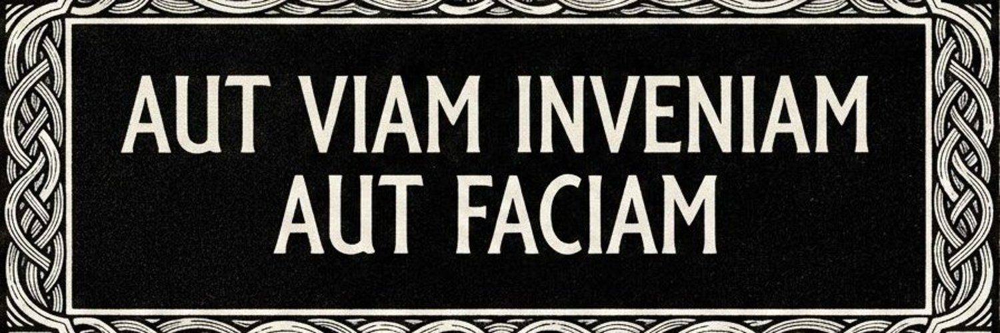

  

# Lacrimae Rerum

Cyber Threat Intelligence analyst working across OSINT, adversary research, DFIR support, offensive-security workflows and analyst automation.

I build local-first tools for intelligence work: systems that help collect, structure, enrich and reason over messy data without turning every workflow into another SaaS dependency.

## Focus

- Cyber Threat Intelligence: collection, enrichment, assessment, reporting and operational context.
- OSINT and attack-surface research: infrastructure mapping, source validation and entity correlation.
- Analyst tooling: local LLM workflows, MCP integrations, Obsidian knowledge systems and automation around real analyst tasks.
- Offensive security support: reconnaissance, lab environments, adversary emulation and deception systems.
- GRC context: turning technical findings into risk language useful for decision makers.

## Current Work

- **Corvus / CorvusEngine**: intelligence-vault workflows, knowledge graphs and analyst-assistance tooling.
- **FlowsINT Corvus**: CTI-oriented entity modeling, enrichment flows and operational UI/API experiments.
- **Offsec Journal**: offensive-team and lab workflow management for engagements, labs, notes and reporting.
- **GRC Suite**: private risk-assessment workflow for executive reporting from OSINT inputs.
- **IT Alignment Chart**: lightweight visual tool for mapping technology posture, business alignment and risk signals.
- **CorvusDossiers**: public intelligence reports generated from Corvus-style analysis pipelines.

## Principles

- Local-first before cloud-first.
- Open, inspectable systems before opaque platforms.
- Terminal-native workflows where they make operators faster.
- AI as analyst augmentation, not analyst replacement.
- Source discipline, confidence calibration and structured analytic thinking over raw data accumulation.

## Stack

Python · TypeScript · Go · Shell · Docker · Linux · FastAPI · Svelte · SQLite · DuckDB · Obsidian · MCP · local LLMs

## Methods And Standards

MITRE ATT&CK · Diamond Model · STIX/TAXII · TLP · structured analytic techniques · source reliability and confidence scoring · NIS2/DORA/ENS-aware reporting context

## Selected Repositories

- [CorvusDossiers](https://github.com/lacrimae0rerum/CorvusDossiers) - intelligence dossiers generated from CorvusEngine-style analysis.
- [it-alignment-chart](https://github.com/lacrimae0rerum/it-alignment-chart) - visual mapping of technology posture, business alignment and risk signals.
- [cronicas-barbaras](https://github.com/lacrimae0rerum/cronicas-barbaras) - interactive knowledge graph viewer.
- [CTI-Bookmarks-Landpage](https://github.com/lacrimae0rerum/CTI-Bookmarks-Landpage) - CTI essentials landing page.
- [html-cti-for-juniors](https://github.com/lacrimae0rerum/html-cti-for-juniors) - CTI learning material.

